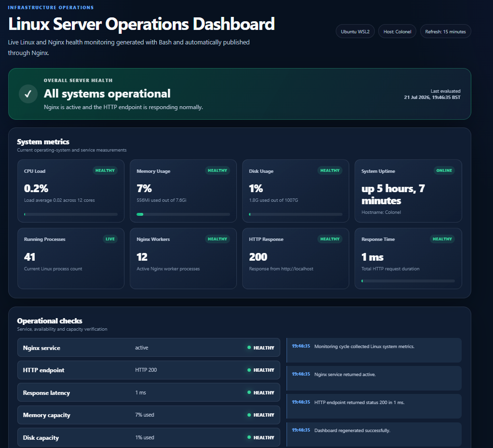
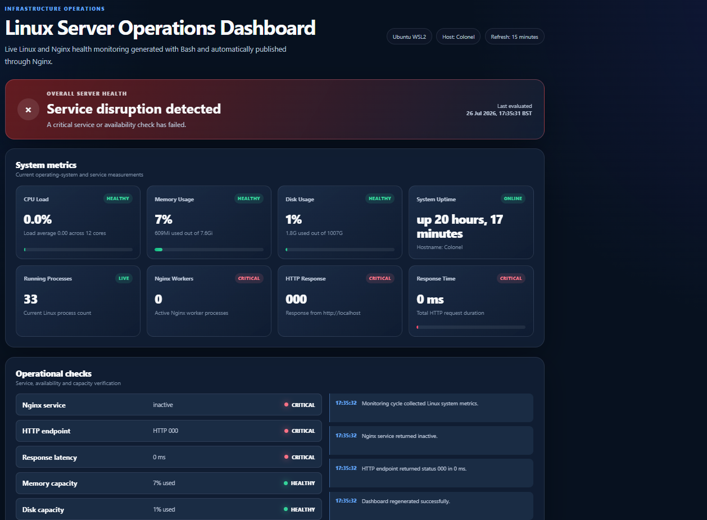
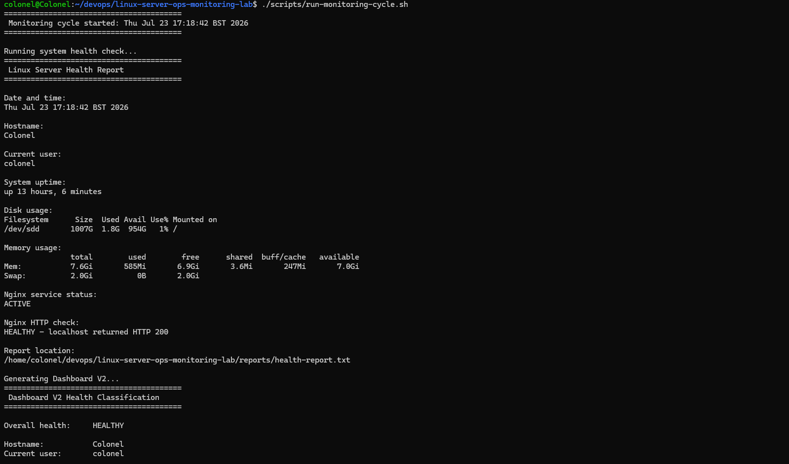

# Linux Server Operations & Monitoring Lab

A practical Linux operations project demonstrating server administration, Bash automation, service monitoring, incident simulation, recovery verification, and an automatically generated web dashboard.

Built with **Ubuntu on WSL2, Bash, systemd, cron, curl, Git, HTML/CSS, and Nginx**.



## Project Overview

This project simulates the responsibilities involved in operating and monitoring a small Linux web server.

The lab includes:

- Installing and managing an Nginx web server
- Inspecting services with `systemctl`
- Investigating system and Nginx logs
- Collecting Linux health metrics with Bash
- Checking service and HTTP availability
- Classifying health as healthy, warning, or critical
- Simulating an Nginx service outage
- Detecting the incident and verifying recovery
- Generating a responsive HTML monitoring dashboard
- Publishing the dashboard through Nginx
- Running the complete monitoring cycle every 15 minutes with cron
- Preserving terminal, HTML, and screenshot evidence in Git

## Monitoring Dashboard

The dashboard is generated from live Linux and Nginx measurements and served locally at:

```text
http://localhost/status-v2.html
```

It displays:

- Overall server health
- CPU load estimate
- Memory usage
- Disk usage
- System uptime
- Running process count
- Active Nginx worker count
- Nginx service state
- HTTP response result
- HTTP response time
- Monitoring-cycle event history
- Last evaluation timestamp

The page is a generated HTML snapshot. Cron regenerates and republishes it every 15 minutes.

## Dashboard Health States

### Healthy state

The healthy state confirms that Nginx is active and the local HTTP endpoint is responding normally.


### Critical state

For the controlled incident test, Nginx was deliberately stopped. The monitoring system detected:

- Inactive Nginx service
- Zero active Nginx workers
- Failed HTTP availability check
- Critical overall server health



`HTTP 000` is not a real HTTP response status. It is the value used by the monitoring script when curl cannot establish a successful HTTP connection.

## Automated Monitoring Workflow

```text
cron — every 15 minutes
        |
        v
scripts/run-monitoring-cycle.sh
        |
        +--> scripts/health-check.sh
        |       |
        |       +--> Linux resource checks
        |       +--> Nginx service check
        |       +--> HTTP availability check
        |
        +--> scripts/generate-dashboard-v2.sh
        |       |
        |       +--> Metric collection
        |       +--> Health classification
        |       +--> HTML generation
        |
        +--> /var/www/html/status-v2.html
                |
                v
              Nginx
                |
                v
     http://localhost/status-v2.html
```

The scheduled cron expression is:

```cron
*/15 * * * *
```

The complete cron command runs `scripts/run-monitoring-cycle.sh` and writes execution output to the monitoring-cycle log.

## Health Classification

The dashboard uses defined thresholds to classify resource health.

| Check | Warning | Critical |
|---|---:|---:|
| CPU load estimate | 70% | 90% |
| Memory usage | 75% | 90% |
| Disk usage | 75% | 90% |
| HTTP response time | 300 ms | 1000 ms |

Nginx and HTTP checks are classified as critical when:

- The Nginx service is not active
- The HTTP endpoint does not return status `200`

A failed HTTP request also makes response latency critical because no valid response time was received.

## Main Scripts

### System health check

```bash
./scripts/health-check.sh
```

Collects Linux resource information and checks:

- System uptime
- CPU load
- Memory usage
- Disk usage
- Process count
- Nginx service state
- HTTP availability

### Dashboard generator

```bash
./scripts/generate-dashboard-v2.sh
```

Collects live metrics, applies health classifications, and generates:

```text
web/status-v2.html
```

The changing generated page is excluded from Git because it is recreated during every monitoring cycle.

### Complete monitoring cycle

```bash
./scripts/run-monitoring-cycle.sh
```

The monitoring cycle:

1. Runs the system health check
2. Generates Dashboard V2
3. Publishes the dashboard into the Nginx document root
4. Records monitoring output in the reports directory



## Failure and Recovery Test

A controlled Nginx outage was used to verify that the monitoring system detects real failures.

The test process was:

```bash
sudo systemctl stop nginx
./scripts/generate-dashboard-v2.sh
```

The dashboard correctly reported a critical service disruption.

Nginx was then recovered with:

```bash
sudo systemctl start nginx
./scripts/generate-dashboard-v2.sh
```

Recovery was confirmed through:

- `systemctl is-active nginx`
- Active Nginx worker processes
- HTTP status `200`
- A healthy regenerated dashboard

Static healthy and critical HTML snapshots are preserved under:

```text
evidence/dashboard-v2/
```

## Service Management

Commands practised during the lab include:

```bash
systemctl status nginx
systemctl is-active nginx
sudo systemctl stop nginx
sudo systemctl start nginx
sudo systemctl restart nginx
```

## Log Investigation

Nginx service and request activity were investigated with:

```bash
sudo journalctl -u nginx --no-pager
sudo tail -20 /var/log/nginx/access.log
sudo tail -20 /var/log/nginx/error.log
```

These commands were used to examine service behaviour, HTTP requests, errors, failure events, and recovery.

## Project Structure

```text
linux-server-ops-monitoring-lab/
├── README.md
├── docs/
│   ├── architecture.md
│   ├── cron-automation.md
│   ├── dashboard-automation.md
│   ├── health-check-script.md
│   ├── log-investigation.md
│   ├── nginx-setup.md
│   ├── service-management.md
│   └── troubleshooting.md
├── evidence/
│   ├── dashboard-v2/
│   │   ├── critical.html
│   │   ├── dashboard-v2.css
│   │   └── healthy.html
│   ├── screenshots/
│   │   └── dashboard-v2/
│   │       ├── critical-dashboard.png
│   │       ├── healthy-dashboard.png
│   │       └── monitoring-cycle-terminal.png
│   ├── command-outputs.md
│   ├── cron-execution.txt
│   ├── cron-health-check-sample.txt
│   ├── final-crontab.txt
│   ├── nginx-failure-report.txt
│   ├── nginx-recovery-report.txt
│   └── status-dashboard-sample.html
├── reports/
├── scripts/
│   ├── generate-dashboard.sh
│   ├── generate-dashboard-v2.sh
│   ├── health-check.sh
│   └── run-monitoring-cycle.sh
├── web/
│   ├── dashboard-v2.css
│   └── index.html
└── reflection.md
```

## Skills Demonstrated

- Linux system administration
- Nginx installation and administration
- Bash scripting
- Service management with systemd
- Linux resource monitoring
- HTTP health checks with curl
- Log investigation with journalctl
- Cron-based task automation
- Monitoring threshold design
- Incident simulation and troubleshooting
- Service recovery and verification
- HTML and CSS dashboard development
- Git branching and version control
- Technical documentation
- Evidence-driven project delivery

## Tools and Technologies

- Ubuntu on WSL2
- Linux
- Nginx
- Bash
- systemd
- systemctl
- journalctl
- cron
- curl
- Git
- HTML
- CSS

## Key Learning Outcome

This project moved beyond running individual Linux commands. It combined system administration, automation, monitoring, troubleshooting, recovery, web publishing, and documentation into one repeatable operational workflow.

The result is a working Linux monitoring lab that detects service health, records evidence, responds visibly to failures, and automatically publishes its current state through Nginx.

---

Built by **Mustafa Mukhtar** as part of a practical DevOps and Linux engineering portfolio.
